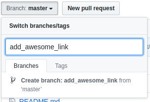
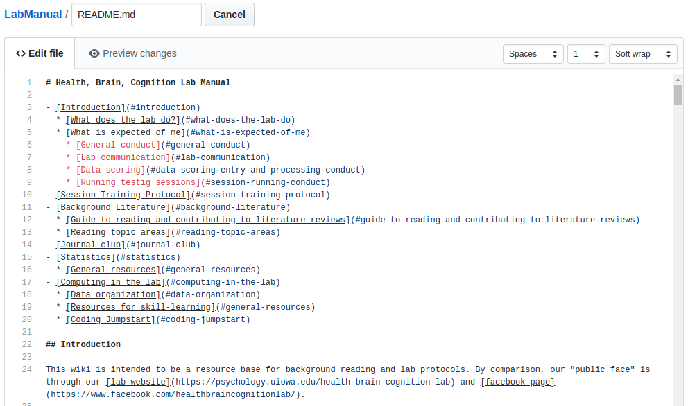
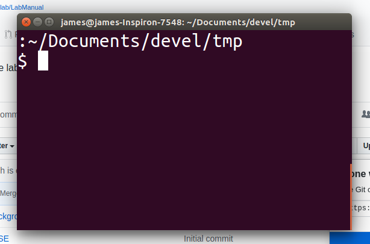
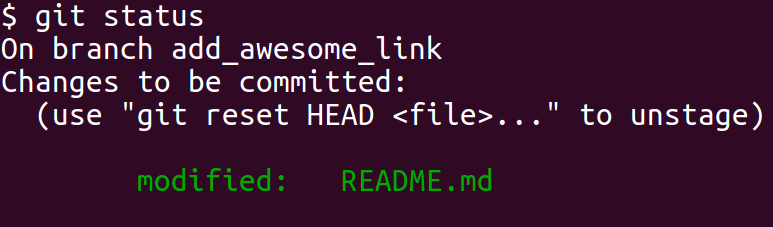

# Health, Brain, Cognition Lab Manual

- [Introduction](#introduction)
  * [What does the lab do?](#what-does-the-lab-do)
  * [Mentoring philosophy](#mentoring-philosophy)
  * [What is expected of me](#what-is-expected-of-me)
    * [General conduct](#general-conduct)
    * [Lab communication](#lab-communication)
    * [Data scoring](#data-scoring-entry-and-processing-conduct)
    * [Running testig sessions](#session-running-conduct)
- [Session Training Protocol](#session-training-protocol)
- [Background Literature](#background-literature)
  * [Guide to reading and contributing to literature reviews](#guide-to-reading-and-contributing-to-literature-reviews)
  * [Reading topic areas](#reading-topic-areas)
- [Journal club](#journal-club)
- [Statistics](#statistics)
  * [General resources](#general-resources)
- [Computing in the lab](#computing-in-the-lab)
  * [Automation Stations](#automation-stations)
  * [Building Singularity Containers](#building-singularity-containers)
  * [Data organization](#data-organization)
  * [Computational Workflows](#computational-workflows)
    - [Behavioral Data Workflow](#behavioral-data-workflow)
    - [XNAT Downloading Images Workflow](#xnat-downloading-images-workflow)
  * [Resources for skill-learning](#general-resources)
  * [Coding Jumpstart](#coding-jumpstart)
- [Improve This Manual](#improve-this-manual)
- [Add Developer to Github Organization](#add-developer-to-hbclab)

## Introduction

This wiki is intended to be a resource base for background reading and lab protocols. By comparison, our "public face" is through our [lab website](https://psychology.uiowa.edu/health-brain-cognition-lab) and [facebook page](https://www.facebook.com/healthbraincognitionlab/). 

### What does the lab do?

Our lab is interested in understanding how to maximize the brain’s capacity for adaptive plasticity across the lifespan. In other words, how to get the most out of your brain as you get older. This includes examining mechanisms associated with declines in plasticity and cognitive function associated with aging, injury, or disease, and determining how we may intervene for improved performance and quality of life. To study plasticity, we are interested in how people learn new skills and abilities, and the lifestyle factors that affect learning and retention. For example, what is the best way to learn how to play the piano? How can we improve our memory for the people we meet and new knowledge we've learned over time? What brain processes support this learning and how do they change throughout the lifespan? Is there anything we can do to improve our ability to learn and remember? Do they differ when we’re thirty compared to seventy? We are particularly interested in cognitive abilities important for successful aging, such as episodic memory, working memory, processing speed, task-switching, and different types of skill learning.

More specifically, our research goals relate to __three broad questions__:

1. __Aging brain and cognition__: How do the brain and cognition change across the lifespan? What are the competing forces of "damage" and "resilience" and how can their process and outcome be measured in testable forms in humans? See this [figure](https://github.com/HBClab/LabManual/blob/master/key-background/Ferrucci-2018-Fig2.png) from [Ferrucci et al, 2018](https://github.com/HBClab/LabManual/blob/master/key-background/Ferrucci-2018-Time%20and%20the%20Metrics%20of%20Aging.pdf) as a visual of these competing  forces which are biological at their root and become phenotypic when they are observable/measurable (e.g., cognitive performance, cardiorespiratory fitness).

2. __Translation__: What are the earliest signs of brain and cognitive decline that are most predictive of functional decline and/or risk for neurodegenerative disease? We hope this work helps define biomarkers that are in the causal pathway of later functional or neurodegenerative decline. These help capture personalized assessment of risk and tracking change over time. Think of this as working our way back to the biological root of changes we later want to prevent, like in this [figure](https://github.com/HBClab/LabManual/blob/master/key-background/Ferrucci-2018-Fig3.png) from [Ferrucci et al, 2018](https://github.com/HBClab/LabManual/blob/master/key-background/Ferrucci-2018-Time%20and%20the%20Metrics%20of%20Aging.pdf) showing the relationship over time of biological, phenotypic, and functional changes with aging.

3. __Neuroplasticity for improved function__: What factors or interventions associate with or maintain brain health and in turn, cognition and everyday function? Here we take what we've learned about the processes of aging and the most predictive markers of age-related functional decline, and determine how to prevent or reverse them through processes of neuroplasticity. The majority of our research on this question examines the impact of how to regularly challenge our brains and bodies to maintain optimal performance throughout life, as shown by this [figure](https://github.com/HBClab/LabManual/blob/master/key-background/Clark-Chapter-Fig1.png) from [Clark et al 2018](https://github.com/HBClab/LabManual/blob/master/key-background/hippocampus-cells-to-systems_clark_final.pdf) We are also interested in how other lifestyle factors, such as sleep and nutrition, affect the potential for neuroplasticity. Key background for this research can be read in Dan Simon's [review of cognitive training](https://github.com/HBClab/LabManual/blob/master/key-background/Simons-2016-Do-Brain-Training-Programs-Work.pdf), and our review on exercise neuroscience ([paper](https://github.com/HBClab/LabManual/blob/master/key-background/Voss-et-al-TICS-2019.pdf), [supplementals](https://github.com/HBClab/LabManual/blob/master/key-background/Voss2019-supplemental-updated.pdf)).

To do this, we use __cognitive neuroscience methods__. For example, we study learning with both basic learning and memory paradigms and applied training experiences such as commercialized “brain training” programs and videogames. To understand neural mechanisms of brain plasticity and cognitive function, we use primarily magnetic resonance imaging (MRI) techniques. We use MRI often because it is the only tool to look at functional brain systems throughout the whole brain at once. MRI data is collected at [MRRF](https://medicine.uiowa.edu/mri/), which is a short 10-12 minute walk from our lab in the Psychological and Brain Sciences Building (PBSB). To help narrow in on the most useful imaging measures collected with MRI, we collaborate to examine mechanisms of cognitive and brain function using other imaging modalities (e.g., ECoG) and species.

### Mentoring philosophy, by Professor Voss

In teaching and mentoring my goal is to empower students to feel comfortable with uncertainty by having the skills to identify unknowns and methodically turn a puzzle into new knowledge. Just as we all approach puzzles differently, students come with diverse perspectives and skillsets, so effective teaching and mentoring requires an awareness to listen, support, and amplify voices from a diversity of backgrounds and perspectives. My hope is that through your experience in this lab you will experience how diversity can spark novel insights, solutions, and knowledge. This philosophy inspires an approach focused on personal interaction, asking questions, open discussion and feedback, and listening and learning from different perspectives. Students will learn the foundations of scientific thinking, analysis, and writing. Whether students I mentor go on to generate new knowledge in a research lab or become mostly consumers of research, my hope is that they will appreciate what good science looks like and the value it can bring when done with curiosity and care. 

### What is expected of me

#### General Conduct

| Expectations for day-to-day culture   | Examples  | Accountability 	|
|:----------------------------------------------------------------------------------------------:	|:--------------------------------------------------------------------------------------------------------------------------------------------------------------------------------------------------:	|:--------------------------------------------------------------------------------------------------------------------------------------------------------------------------------------------------------------------------------------------------------:	|
| **Teamwork** 	| 1. Support each other, be on each others' team   2. Choose a positive attitude   3. Help   4. Openness to feedback for improvement 	| 1. Weekly check-ins with project coordinators and graduate students   2. Check-ins with all students and staff on interactions and comfort with project coordinators and grads   3. Feedback opportunities from participants on their experience (good and what to improve) 	|
| **Respect** each other and collaborators, the lab, our participants, and the data 	| 1. Awareness of open workspace (noise, your stuff, etc.)   2. Be aware of data files being open (hard or electronic) 	|  1. Weekly check-ins with staff and/or grad you're working with   2. Personal check-ins: ask yourself whether what you're doing could negatively affect someone else in the space or confidentiality of data   3. Document mistakes and let your supervisor for the task know, and discuss strategies to prevent it next time.	|
| **Persistence** and attention to **details**: Every task is important! 	| 1. Document any confusion in protocols or instructions   2. Document trouble-shooting efforts and then seek help/feedback 	| 1. Document lab activities in a notebook   2. Open an issue on the relevant github repository.	|
| Develop **scientific literacy and skills** and knowledge of the **broader impact** of our work 	| 1. Attend journal club and be engaged (read and ask questions)   2. Be open and proactive in learning new skills via tutorials or research tasks   3. Be proactive about suggesting topics to learn about 	| 1. Attendance and engagement   2. Work towards presenting a paper or data at journal club   3. Document goals, feedback, and progress and set up meetings to review in person 	|

#### Lab communication
- **Slack:** All lab members should have a [slack](https://slack.com/) account. This will be primary means of communication. Install Slack on your mobile device, work desktop, and laptop, and make sure to set your time zone correctly and tocustomize the notification preferences so that you see what you need to see, but are not overwhelmed. Ask Professor Voss or a graduate student to send you and invite, and say hi on the general channel when you're in.
- **Calendar:** All sessions are scheduled via our google calendar. 
    * Ask your project coordinator or supervising graduate student how to access this calendar. 
    * The calendar of scheduled sessions and who is running them is also circulated via a weekly email update.
- **Scheduling meetings with Professor Voss:** Professor Voss is always happy to chat! Please be respectful of the time, you are expected to show up to scheduled meetings. Canceling is fine but please give advance notice. 
    * Use this [link](https://calendly.com/mwvoss) to see open times and sign up for an appointment. It is always preferred to indicate your goal for the meeting in the appointment request. Please note, we do not always have to go the whole time, if we have accomplished our goals early, it's ok to end early! 
- **Email:** 
    * University email is often used for communication with collabortors and any correspondance that would be best to have official documentation of. If you're unsure, just reach out via slack and it's always an option to summarize the discussion with a follow-up email.
    * All communication with participants occurs through our lab email (pbs-hbclab@uiowa.edu).

#### Data scoring, entry, and processing Conduct

- Respect that you are working on hard-earned, confidential data
  - Our lab members worked hard on it
  - The participants worked hard to participate in our studies
  - Take care in scoring and entering data with precision, all the hard work of your lab-mates and participants goes to waste if we don’t enter the data properly!
  - Don’t hesitate to ask a question if you’re unsure how to code or proceed with something
    - If no one is around, email Professor Voss, the lab manager, or the coordinating graduate student or post-doc
    - If no one can answer your question, we’ll discuss it as a group at a lab meeting and try to come up with a good solution
- Don’t leave data folders with confidential information sitting out unattended
- If the data sheet you’re working on is shared among several lab mates, always save and close the data sheet when you’re done
  - You will almost always save it back to where you opened it from
  - If you have any questions about whether to overwrite previous versions or to save a new version with your progress, ASK!

#### Session Running Conduct

| Expectations for interactions with participants |                                                                                                                                                                  Examples                                                                                                                                                                  |                                                                                 Accountability                                                                                 |
|:-----------------------------------------------:|:------------------------------------------------------------------------------------------------------------------------------------------------------------------------------------------------------------------------------------------------------------------------------------------------------------------------------------------:|:------------------------------------------------------------------------------------------------------------------------------------------------------------------------------:|
| **Participants have a good experience**         | 1. Be early and greet with a smile    2. Introduce yourself   3. Empathize and be supportive    4. Don't be distracting in the background of testing                                                                                                                                                                            | 1. Feedback opportunities from participants on their experience (good and what to improve)                                                                                                    |
| **Testing and training are standardized**       | 1. Follow testing protocols, document **any** deviations or questions    2. Maintain consistency in instructions and feedback to participants questions                                                                                                                                                                                            | 1. Document lab activities in a notebook    2. Open an issue on the relevant github repository                                                                                         |
| **Data are complete and valid**                 | 1. Complete data files are saved    2. Data are backed up on github or redcap after the session   3. Participants were able to understand and complete the task under standardized conditions                                                                                                                                                          | 1. Ask your project coordinator how to view the data quality reports for the tasks you've run   | 2. Be respectful and open to improvement when receiving "coaching" from labmates.                                                                                                                                                                  |
| **Confidentiality**                             | 1. Do not talk about participants with their names in the lab space or with other participants   2. Do not leave other participant's data files open where another participant could see   3. Names should not be on data files except for the project manager's protected tracking sheet   4. If you are the last one to leave the lab and materials are out with identifying information, ensure it's in a locked location before you leave.   5. Be sensitive about interaction with participants while other participants are around | 1. Breaches in confidentiality could have major consequences -- this is serious! When in doubt, ask Professor Voss.   2. Feedback opportunities from participants on their experience (good and where to improve) |

#### Before Session

- Be a qualified assessment leader by completing training on how to lead the session
- Be prepared!
  - Know what study and session you are running
  - Bring study protocol for reference
  - Have phone numbers of lab members
- Come 15 min before session
  - Prepare participant paperwork
  - Gather folder and other necessary items

#### During Session

- Greet participant, do your best to refer to each participant by name
- Introduce yourself and confirm their name and appointment type
- Be professional, polite, respectful, and patient at all times
- Ask for help from other lab members if you need it!

#### After Session

- Thank the participant for coming in
- Fill out the payment form and remind them a check will come shortly; they should call us if it doesn’t
- Ask if they remember how to get out so you can help if not (they don’t take offense in my experience)
- Put folders and session materials away

## Session Training Protocol

Trainer is expected to conduct the following sessions before the trainee is qualified to run sessions independently. Trainee is required to read this protocol to understand training expectations during all training sessions. An example training log is shown below, the trainer is required to record date, Pass/Fail, and initial after each training session. Only when the trainee completes all four training sessions successfully will trainee be considered fully qualified to independently run sessions. If there are sessions that are the same between studies, trainee is considered qualified upon completing training for the session for one of the studies. If sessions are similar but not the same, trainee still must complete training, but the training session may be modified.

### Who can be a "trainer"

- Professor Voss
- Lab manager
- Graduate student or post doc overseeing the study
- Anyone judged by Professor Voss or the lab manager to have run a sufficient number of sessions in the study

#### Session 1 - Protocol Meeting

- Trainer will go over the protocol of the session with trainee in a demonstration form
- Trainee is expected to have thoroughly read the protocol and ask questions
- It may be helpful for the this session to end with the trainee walking through the steps, as a way to generate questions

#### Session 2 - Shadowing

- Trainee will shadow a trained subject runner
- This should be scheduled within one week of the protocol meeting
- Trainee should arrive 15 minutes early and be prepared for session
- Trainee should introduce them self to the participant and tell them that they will be shadowing the session

#### Session 3 - Paired Practice

- Trainee will practice the session with another trainee or trained subject runner
- Trainee should treat this as if it were an actual session
- Practice partner does not need to actually do the tasks, but trainee is expected to instruct practice partner through all tasks, even those on the computer
- Practice partner should interrupt if something has been done not to protocol and correct trainee

#### Session 4 - Observed Session

- Trainee will administer a session with a trained subject runner observing the session
- Trainee will be expected to conduct session as if the observer was not present
- Trainee will introduce observer to participant by saying “This is \<name\> he/she will be observing my performance in this session today”

## Background Literature

### Guide to reading and contributing to literature reviews

Below is a list of topics separated and outlined by topic. Some are general interest topics and others relate specifically to the methods and research questions relevant to our lab.

As part of the lab, we want you to be both a consumer and producer of this page. To consume and get the most out of your reading, please read the reading questions and consider these for each review or primary article that you read. It's expected that you'll run into questions, so don't be shy to contact someone in the lab to discuss your answers to reading questions. This includes other undergraduates in the lab, the graduate student or staff you work with most, and Professor Voss. To produce and generate new information on these pages, you should:

(1) Consult with a graduate student or Professor Voss to find out about which topic(s) are priority

(2) Search for new papers; we often use PubMed or Google Scholar (see here if you're not sure how to do this)

(3) Pick a set of 1-2 papers to read that may be relevant to your search topic; answer reading questions as you read each, and document answers on the reading response form (which you can download below). Note you may have to skim more papers than you actually read in depth. I would suggest once you find a promising abstract, to skim to make sure it's relevant.

(4) Make an appointment to discuss the articles with the graduate student you're working with or Professor Voss (whoever you first consulted with). Facilitate discussion by sending PDFs of the articles and your responses, as this will be a guide for discussion. 

(5) Once we're ready to add an article, email a PDF of the article(s) to Professor Voss, along with the final (electronic) copy of the reading response form(s). Professor Voss will update the wiki.

#### Reading questions

Journal articles are the way scientists communicate their ideas and results to one another. The dissemination of hypotheses and findings in this way is fundamental to the process of progress in science because it maintains rigor (through peer-review) while also making new research publicly available to other labs that may try to replicate or extend the published studies in their own lab. Thus, the ability to read and interpret articles in the primary literature, both in terms of methods and results and the conclusions/interpretations that can be drawn, is a fundamental skill for a successful scientist. These questions are meant to help critically analyze research articles, so you can evaluate when a paper is a good contribution to the literature, i.e., it creates new knowledge.

### Reading topic areas
* Best practices and methods for good science 
    * Recommended journals: [Advances in Methods and Practices in Psychological Science (AMPPS)](https://www.psychologicalscience.org/publications/ampps), [Psychological Methods](https://www.apa.org/pubs/journals/met/)
* Cognitive neuroscience concepts, methods, and applications
    * Recommended journals: [Trends in Cognitive Sciences](https://www.cell.com/trends/cognitive-sciences/home), [Journal of Cognitive Neuroscience](https://www.mitpressjournals.org/loi/jocn), [NeuroImage](https://www.journals.elsevier.com/neuroimage), [Human Brain Mapping](https://onlinelibrary.wiley.com/journal/10970193), [Cerebral Cortex](https://academic.oup.com/cercor), [Psychophysiology](https://onlinelibrary.wiley.com/journal/14698986)
    * Online learning: [Coursera course on Principles of fMRI](https://www.coursera.org/learn/functional-mri#about), [Andy's Brain Book](https://andysbrainbook.readthedocs.io/en/latest/)
* Aging Brain and Cognition
    * Recommended journals: [Psychology and Aging](https://www.apa.org/pubs/journals/pag/), [Neurobiology of Aging](https://www.journals.elsevier.com/neurobiology-of-aging), [The Journals of Gerontology](https://academic.oup.com/biomedgerontology)
* Physical activity and its effects on the brain and cognition
    * Recommended journals: [Geroscience](https://www.springer.com/journal/11357), [Brain Plasticity](https://www.iospress.nl/journal/brain-plasticity/), [Medicine and Science in Sports and Exercise](http://www.acsm.org/read-research/journals-bulletins/medicine-science-in-sports-exercise)

## Journal club: 
* [Live schedule for journal club](https://docs.google.com/spreadsheets/d/1CAcr187eyFtnmr0Niwi1D_aDZ346DuztRbbVDkO4vW0/edit?usp=sharing)
* **General overview:** 
  * **Purpose**: Time to come together to hear what lab-mates are up to, get feedback on your work, learn from other's in the lab, practice evaluating primary literature, get oriented to new tools or professional development topics of general interest 
  * **Who should come?** Everyone is welcome! 
    * Full-time post-docs and graduate students, including rotation students, are expected to come to all meetings. 
    * Staff, affiliated students, and undergraduates are expected to come when topics align with their interests and/or projects they're working on. It is also expected that study sessions that can only happen during journal club take priority.
  * **When & where** Monday's from 11am-12:15pm, the schedule above is regularly kept up-to-date so it's the best resource for updates on where we're meeting, topics, and related readings or links.

## Statistics  

### General resources
- Online courses and textbooks:
   * Introductory coursera course on [better statistical questions](https://www.coursera.org/learn/improving-statistical-questions) and [better inference](https://www.coursera.org/learn/statistical-inferences/)
   * Russ Poldrack's online book [statsthinking21](https://statsthinking21.org/) with examples in R and Python.
   * Visualizations
      * RPsychologist [visualizations](https://rpsychologist.com/viz)
      * James Kent's collection of helpful [vizualizations of statistical concepts](https://github.com/jdkent/visualizeStatisticsConcepts) 
      * Overview [diagram](https://st4.ning.com/topology/rest/1.0/file/get/2852610171?profile=original) of what statistics to use for different types of questions
   * Linear regression and mixed models
      * [Jeannette Mumford's video series on mixed models](https://www.youtube.com/watch?v=IGHm1XHFWMc&list=PLB2iAtgpI4YEAUiEQ1ZnfMXY-yewNzn9z)
      * [Dr. Lesa Hoffman's courses at Iowa](http://www.lesahoffman.com/Courses.html): Materials and lectures available online within course websites
      * Introductory coursera course on [linear regression](https://www.coursera.org/learn/regression-models) with R examples throughout.
      * Power analysis with [linear mixed models](https://rpsychologist.com/do-you-need-multilevel-powerlmm-0-4-0)
- Recommended statistical programs with graphical user-interfaces: 
  * [JASP](https://jasp-stats.org/download/) is one of Professor Voss's recommended statistical package for analyses when you'd like to work with a graphical-user-interface (point-and-click), which is often sufficient and quicker for basic descriptive tables and plots and many basic analyses. They offer many [online resources](https://jasp-stats.org/support/) for learning statistics and how to use the program. This is a good "first step" away from Excel and SPSS for statistics. The software also comes with many example datasets to see example analyses described in the tutorials. 
   * [Jamovi](https://www.jamovi.org/) is another free statistical software that offers a graphical user interface. Similar to JASP, there is a free [statistics textbook](https://www.learnstatswithjamovi.com/) for beginners to learn statistics. This is a great first step towards using R, and there are a growing number of "modules" for accessing statistical analyses and visualizations written in R and ggplot with a graphical user-interface. 
   * Note both JASP and Jamovi are best applied after the data has been pre-processed with documented code using R / python / bash etc, as you should avoid changing data with point-and-click software that doesn't document what you did in each step!

## Computing in the lab

### Automation Stations

Contact for administrator of computers: bradley-carson@uiowa.edu

We have two computers (one physically in lab and one located off-site) to help with automation of tasks.
The computer physically located in lab is only for testing and playing and should not be used for any automation.
The computer located off-site is the computer we can rely on to run jobs automatically.
These computers have different addresses:

- computer physically in lab: `r-lnx506.psychology.uiowa.edu`
- computer located off-site: `vosslab.psychology.uiowa.edu`

To login to either of these computers, I'm assuming you are using either a Mac or linux computer
(if you need to login using Windows, check out [PuTTY](https://www.putty.org/)).
The general form of logging into the computers is:
- `ssh HAWKID@COMPUTER-ADDRESS`

where `HAWKID`
is your University of Iowa hawkid, and `COMPUTER-ADDRESS` is one of the two computer addresses above.
For example, if I wanted to log in to the computer located off-site, I would type:
- `ssh jdkent@vosslab.psychology.uiowa.edu`.

If you are unable to log in, but believe you should have access,
contact Bradley Carson with Michelle Voss cc'd.

Once logged in, if you want to modify the `crontab` or do other work, you need to switch from your username
to the lab service account `vosslab-svc`.
To do so, type:
- `sudo -u vosslab-svc -i`

If are unable to login as `vosslab-svc` or if the
terminal asks you for a password, and you believe you should be able
to, contact Bradley Carson with Michelle Voss cc'd.

[James wrote an introduction to crontabs if you want a
jumpstart](https://slides.com/jameskent/cron)

### Building Singularity Containers

While we use [Docker](https://www.docker.com/resources/what-container)
to create software containers, Docker requires elevated
privileges to run, which is not possible in a high performance
computing (HPC) environment.
Luckily, developers made [Singularity](https://sylabs.io/docs/)
to circumvent the requirement for elevated privileges.

We use singularity to create singularity containers that run our software in an isolated environment
with all the software dependencies installed.
We keep all the singularity containers we build in the 
`<mount-location>/vosslabhpc/UniversalSoftware/SingularityContainers/`
directory.
To build a singularity container, we use the general form:
- `singularity build SOFTWARE-vX.Y.Z.sif docker://SOFTWARE:vX.Y.Z`

where software represents the code we want to make a container for,
and X.Y.Z represents the version of the code we want to use.
The `v` in the docker tag (`vX.Y.Z`) is not always there, so
be aware what the available docker tags are in dockerhub.

For example, if I wanted to build a singularity container for `xnat_downloader`, I would type:
- `singularity build xnat_downloader-v0.2.8.sif docker://jdkent/xnat_downloader:v0.2.8`

or if I wanted to build a version of `fmriprep`, I could type:
- `singularity build fmriprep-v20.1.1.sif docker://poldracklab/fmriprep:20.1.1`

### Data organization

- We follow a [Project Template Structure](https://github.com/HBClab/ProjectTemplateStructure/blob/master/README_MASTER.md)
that is described in detail by the link.
  - There are multiple READMEs distributed through the repository describing what
  files go into which directory
    - [0-projectBackground](https://github.com/HBClab/ProjectTemplateStructure/blob/master/0-projectBackground/README.md)
    - [1-projectManagment](https://github.com/HBClab/ProjectTemplateStructure/blob/master/1-projectManagement/README.md)
    - [2-ethicsGovernance](https://github.com/HBClab/ProjectTemplateStructure/tree/master/2-ethicsGovernance/README.md)
    - [3-experiment](https://github.com/HBClab/ProjectTemplateStructure/blob/master/3-experiment/README.md)
    - [4-dissemination](https://github.com/HBClab/ProjectTemplateStructure/blob/master/4-dissemination/README.md)
- There is also a [list of readings](https://github.com/jdkent/dataEntryReadings) if you wish to understand why/how we organize our data

### Computational Workflows

General workflows for acquiring/working with data in the lab.

#### Behavioral Data Workflow

(Click on image to get access to useful links)

- [Some (slightly outdated) reading to understand this process](https://jdkent.github.io/2018/11/20/Setup-for-Data-QA.html)
- [Other slides describing this process](https://slides.com/jameskent/deck)

#### XNAT Downloading Images Workflow

(Click on image to get access to useful links)

## Coding Jumpstart

We are excited that you want to pick up the basics for learning to code and help out
with some of the more technical aspects of data collection and analysis.
Persistance is key, but Professor Voss and the graduate students will be here to help you along your journey.
If you are a graduate student, then more senior graduate students will help.
What I will outline below are some soft suggestions of what to learn about;
everyone may have different resources that "click" for them, so stick to what helps you.
With that said, there does not exist a resource that makes anything "easy"; there is not
a replacement for persistance and asking for help when you get stuck.

### General Resources

- [stackoverflow](https://stackoverflow.com/): 95% of your questions are answered here,
but first you need to learn how to google your question.
- [software carpentry](https://software-carpentry.org/lessons/): these are excellent lessons that
cover a lot of goals we want to accomplish.
- [basecs podcast](https://www.codenewbie.org/basecs): if you want to learn some of the
fundamentals of computer science (building a conceptual framework to place facts in is **very**
important for novices)
- [2019-OHBM Hackathon Resources](https://github.com/ohbm/hackathon2019/blob/master/Tutorial_Resources.md):
excellent collection of tutorials/resources to learn all things programming as they
relate to neuroimaging

### General R Resources

- [coursera: R-Programming](https://www.coursera.org/learn/r-programming)
- [coursera: R-programming environment](https://www.coursera.org/learn/r-programming-environment)
- [R for psychological Science](https://psyr.org/index.html)
- [Tidynomicon: Understanding R from a python perspective](https://gvwilson.github.io/tidynomicon/)
- [R for datascience](https://r4ds.had.co.nz/index.html)
- [Advanced R](http://adv-r.had.co.nz/)

### General Python Resources

- [Corey Schafer Python Tutorials](https://www.youtube.com/user/schafer5/playlists)
- [RealPython Website](https://realpython.com/)
- [Learn Python Wiki](https://www.reddit.com/r/learnpython/wiki/index)

### General Shell Resources

- [Conquering the command line](http://conqueringthecommandline.com/book/frontmatter)
- [Learn shell](https://www.learnshell.org/)
- [The shell introduction I wish I had](https://dev.to/maxwell_dev/the-shell-introduction-i-wish-i-had-551k) by Max Antonucci
- [The Unix shell](http://swcarpentry.github.io/shell-novice/)
- [Andrew Jahn's Unix introduction](https://www.youtube.com/watch?v=dBDmIhSWfnM&list=PLIQIswOrUH6992C4FDDCNCIaK4R2FIOCB)
- [Bash cheatsheet](https://devhints.io/bash)
- [Explain shell commands](https://explainshell.com/)
- [Check shell scripts](https://www.shellcheck.net/)
- [Vim interactive tutorial](https://www.openvim.com/)

### Data Technology Stack

Here is a list of the current technologies/software used in the lab

- [bash](https://en.wikipedia.org/wiki/Bash_(Unix_shell))
  - used as the glue for automation and coordinating other languages together
- [R](https://www.r-project.org/about.html)
  - excellent tool for data wrangling,
    making statistical models, and making straight-forward images.
    Basically everything you would want for data analysis.
- [python](https://www.python.org/)
  - second best tool for anything, so your job is to do everything,
    python will make your life easier.
    (everything = querying databases, downloading data, preprocessing data, visualizing data, creating reports, analyzing data, machine learning models, etc.)
- [Matlab](https://www.mathworks.com/products/matlab.html) ([Octave](https://www.gnu.org/software/octave/)): very rarely
  - Had it's hay-day, now is slowing being edged out by
    the free R and python languages, if you have a choice,
    don't learn Matlab.
    Octave is the open source version of matlab, still not very popular among
    the people I've collaborated with.
- [git](https://git-scm.com/)
  - take snapshots of your code/writing to save them
    and collaborate with others
- [github](https://github.com/) ([gitlab](https://research-git.uiowa.edu/users/sign_in))
  - these are websites that can host your code/writing that you want to share
- [singularity](https://sylabs.io/docs/)
  - like a "virtual" computer you can run on your computer,
    you can share this computer with other people
    so you do not have to worry as much about the
    eternal problem of "it works on my machine"
    (but not on yours).
    You can use Singularity with high performance computers (HPC)
    on [Argon](https://wiki.uiowa.edu/display/hpcdocs/Argon+Cluster)
- [docker](https://www.docker.com/)
  - similar to singularity except you cannot use it on Argon
    (but docker is still useful for [continuous integration](https://circleci.com/continuous-integration/)
    and [development of code](https://github.com/cdr/code-server))
- [circleci](https://circleci.com/)
  - tests code for us to make sure it works as expected, 
    and more generally can run any arbitrary code to
    do cool things.
    circleci can use the "virtual" computers made with docker,
    so you know if the tests pass on circleci, the tests will
    also pass when you are using docker.
    circleci is the primary continuous integration tool we use.
- [travisci](https://travis-ci.com/)
  - tests code similarly to circleci, but historically was easier
    to test code using different environments (python 3.5, 3.6, 3.7, 3.8, etc)
- [linux](https://en.wikipedia.org/wiki/Linux)
  - The operating system that runs all the "virtual" computers
    made by singularity and docker.
- [VSCode](https://code.visualstudio.com/)
  - currently the most popular Integrated Developement Environment (IDE)
    to write code in.
    Has an awesome plugin for python, but VSCode works
    for a variety of languages, so if you are going to write code
    in multiple languages, VSCode is a great choice.
- [Rstudio](https://rstudio.com/index2/)
  - you use this when writing R code,
    lots of convenient features to interactively write code.

### Beginner Goals

#### Beginner Git/Github Goals

- know the definition of a version control system
- know how to use [github desktop](https://desktop.github.com/) to add experimental files to github

#### Beginner Shell Goals

- be comfortable navigating folders/directories
- copying/moving/creating files

#### Beginner R Goals

- install R
- install Rstudio
- read in a tabular file (as a dataframe)
- summarize columns of data

#### Beginner Python Goals

- install anaconda
- install vscode

#### Beginner Shell/R/Python Goals

- understand how to make a variable
- understand the concept of a function
- know that lists, arrays (vectors), dictionaries (associative arrays) are things called data structures.
- solve a simple problem related to your work

### Beginner Resources

#### Beginner Git/Github Resources

- Sections 1.1-1.3 of [pro git](https://git-scm.com/book/en/v2/Getting-Started-About-Version-Control)
- [adding participant data](https://github.com/HBClab/addGitData/blob/master/README.md)

#### Beginner Shell Resources

- [Shell Overview](https://dev.to/maxwell_dev/the-shell-introduction-i-wish-i-had-551k)
- [Andrew Jahn's Unix Lessons](https://www.youtube.com/watch?v=dBDmIhSWfnM&list=PLIQIswOrUH6992C4FDDCNCIaK4R2FIOCB)

#### Beginner R Resources

- Week 1 of the [R coursera course](https://www.coursera.org/learn/r-programming?action=enroll)
  - You can create an account and audit the course for free
- Episodes 1-4 of the [R-Podcast](https://r-podcast.org/articles/6/)

#### Beginner Python Resources

- [anaconda](https://www.anaconda.com/distribution/)
- [vscode](https://code.visualstudio.com/)
- [Corey Schafer's Beginner Python Series, Ep. 2-5](https://www.youtube.com/watch?v=k9TUPpGqYTo&list=PL-osiE80TeTskrapNbzXhwoFUiLCjGgY7&index=2)

### Intermediate Goals

#### Intermediate Git/Github Goals

- use git via the commandline (or through vscode)
- know the concepts (and their respective git commands):
  - clone
  - pull
  - branch
  - add
  - commit
  - push
- know how to fork a repository on github

#### Intermediate Shell Goals

- understand ssh and how to access our servers (and argon)

#### Intermediate R Goals

- learn about certain dataframe manipulations
  - how do I subtract the mean from a column?
  - how do treat a column as a factor? (what's a factor?)
- make your first linear model
  - (e.g. how does fitness predict reaction time for a task)

#### Intermediate Python Goals

- learn what a debugger is (and learn to use `pdb` or the vscode builtin)
- learn what a linter is (and set up vscode to use one)

#### Intermediate Shell/R/Python Goals

- Understand control flow (if statements/for loops)
- write your first script (use functions!)

#### Intermediate Git/Github Resources

- [git/github cheatsheet](https://github.github.com/training-kit/downloads/github-git-cheat-sheet.pdf)
- go through [git novice](http://swcarpentry.github.io/git-novice/)

#### Intermediate Shell Resources

- go through [shell novice](http://swcarpentry.github.io/shell-novice/)

#### Intermediate R Resources

- weeks 2&3 of [R coursera course](https://www.coursera.org/learn/r-programming?action=enroll)

#### Intermediate Python Resources

- video on debugging [through vscode](https://www.twitch.tv/videos/390109213)
- [Real Python Debugging Tutorial](https://realpython.com/python-debugging-pdb/)
- [Real Python Linting](https://realpython.com/python-code-quality/)
  - check the link for VSCode to set up a linter for your text editor
- go through [python novice](http://swcarpentry.github.io/python-novice-inflammation/)

## Improve this Manual

You may have read this manual and saw a typo or wanted to add a new resource.
THANK YOU!
We encourage and welcome your contributions!

If you have never used github before, no worries,
we will walk you through step-by-step.

### Step 1: Fork the repository

The first step is to "fork" the LabManual, which gives you your own copy
of the LabManual that you can safely do whatever you want with without
affecting the original LabManual.

1. Click the button with the word "Fork".
   

1. A screen should appear asking where to fork the repository (i.e., the LabManual).
   Select your own github profile.
   

1. You should now see the LabManual under your own account.
   You can tell that your repository is a fork by looking in
   the upper left corner of your screen.
   There should be the tiny phrase: "forked from HBClab/LabManual"
   

1. If you would like to make the edits locally on your computer,
   instead of on github, see the [terminal instructions](#step-2-clone-the-repository-terminal).

### Step 2: Create a new branch

Having your own fork of the repository is nice, and it is even nicer to
have your own branch.
Creating a new branch lets you and your collaborators know what you are working on.
Besides, "master" is not a very descriptive name to describe the changes you want to make.

1. Click on the `Branch: master` button.

   

1. Name your branch something descriptive, like `add_awesome_link`.
   Hit enter after you name your branch to create it.

   

1. You should now be on your new branch, instead of `master`, you can see
   `add_awesome_link`

   

### Step 3: Make your edits

With forking and branching out of the way, you can start making edits.
This is the change you wanted to make in the first place!

1. Assuming you are editing`README.md`, you will want to click on that file.

   

1. Now you can see the contents of `README.md`, but you cannot edit yet.
   To edit, click on the pencil icon.

   

   

1. The interface should change and look something like this:

   

1. Make the edits/add the links!

   

### Step 4: Commit your changes

Commiting your changes is like creating a savepoint that
you can go back to at any time.
If you've ever overwritten your work and wanted an
easy way to go back without hitting control-z a
billion times, git has got you covered.

1. At the bottom of your screen, there should be a
   a text box to write your commit message.
   It is encouraged to write your commit message
   using [imperative language](https://chris.beams.io/posts/git-commit/#imperative) (“spoken or written as if giving a command or instruction”)

   

1. Once satisfied with what you've written, click
   `commit changes`

### Step 5: Open a pull request

With your edits saved on your fork, you would like the
original `HBClab/LabManual` to also have those edits.
To request those changes you will open a "Pull request".
As in, I would like the `HBClab/LabManual` to please
pull the changes on my branch from my fork (e.g., `jdkent/LabManual`)
and incorporate them into the `HBClab/LabManual`
master branch.
That's a bit of jargon soup, but with enough repetition,
all those words will become familiar to you!

1. Right after you make your commit, you can select the
   "Pull Request" tab.

   

1. If you just made the commit, there should be a greenish banner on your page.
   Click on "Compare & pull request"

   

1. You should be directed to a new page with a text box
   to give information about your pull request.
   First, however, we should double check, to make sure that the base repository is `HBClab/LabManual`
   and that the base branch is `master`.
   The base repository is the repository we want to change.
   The "head" repository is the one we edited, specifically on the `add_awesome_link` branch.
   If the base or head repositories are not what you want, change them now.

   

1. Next, give a title to your pull request and any
   other additional information to give anyone else
   reading the pull request why you made your changes.

   

1. When you are satisfied with what you've written,
   click on "Create Pull Request"

   

1. Congrats, you've opened a pull request!

   

### Step 6: Responding to reviews

To help improve the edit you are suggesting,
someone may review your pull and request you make
some changes.
It's awesome that you took the time to open the pull
request and it's awesome someone else took the time
to review your edits, we are all trying to make
the document better.
Sometimes the reviewer may have some suggestions for
your edits before they are accepted and merged.

1. read the review

   

1. Go back to your branch on your fork of LabManual
   and select edit mode as you did in [step 3](#step-3-make-your-edits)

   

1. commit the changes as you did in
   [step 4](#step-4-commit-your-changes)

   

1. There is NO NEED TO OPEN A NEW PULL REQUEST.
   Since you've already opened a pull request, any
   new commits are automatically added to your existing pull request.

   

### Conclusions

You may repeat [step 6](#step-6-responding-to-reviews)
multiple times, or none at all, but whichever the case,
be proud of the work you've completed.

This may appear to be a drawn out process to make a
simple edit (and you are right to think so), but the
steps you've learned are used to handle much more complex
changes, so consider this an investment to be able to
tackle that complex change you may want to make to
another project tomorrow, next month, or next year.
Some members of the lab use this workflow every day,
making it important to learn for effective collaboration.

Below are "advanced" instructions for making the edits on your computer instead of using the github website.

### Step 2: Clone the repository (terminal)

Cloning a repository gives you a local copy of the
repository on your laptop or machine.

1. From your forked repository, select the `Code` button.

   

1. The button should expand a small menu, with a url
   and a clipboard next to it.
   Click on the clipboard to copy the text.

   
   

1. Open a terminal on your local laptop/machine

   

1. Type `git clone` and then either `control+shift+v`
   or `command+shift+v` whether you are using windows/linux or mac.
   The result should look something like the following.

   

1. Hit enter, and the repository should download to
   your computer.
   The output should look like the following:

   

1. Type `cd LabManual` to change directories into the repository.
  You are now ready to make edits.

### Step 3: Make your edits (terminal)

1. Type `ls` to see the contents of `LabManual`

   

1. Create a new branch with `git checkout -b add_awesome_line`

   

1. Open your favorite text editor in this directory.
   (mine is [vscode](https://code.visualstudio.com/)).

   

1. Open `README.md` to make your edits.

   

### Step 4: Commit your changes (terminal)

1. Type `git status` to see what changes are "unstaged"

   

1. Type `git add README.md` to stage the file.
   We have not taken the snapshot yet, this just
   prepares what items we want to take a snapshot of.
   (like getting all your family members together for
   a picture).

1. Type `git status` again to see `README.md` in the staging area.

   

1. Use `git commit -m '...'` to commit your changes.
   Replace `...` with your actual commit message.

   

1. Finally, you can push the changes to your forked
   repository on the new branch you have created with
   the command: `git push origin <name of branch>`.
   Replace `<name of branch>` with the actual name of
   your branch.

   

1. Now you can continue with [step 5 on github](#step-5-open-a-pull-request)

## Add Developer to HBClab

In order to administer travis-ci/circleci and other github applications that help with testing,
you need to explicitly give people permission so
they can add passwords/change workflows, and generally be
useful to maintain our software.

This was a little unclear to do so we're leaving a note in the manual on how to do this.

1. Go to the [HBClab page](https://github.com/HBClab) and click on the settings tab.

2. Click on GitHub Apps under "Developer Settings"

   

3. Add the user you want to have access to travis/circleci/etc.

   

Now that person should be able to access/administer all our repository workflows in HBClab.
